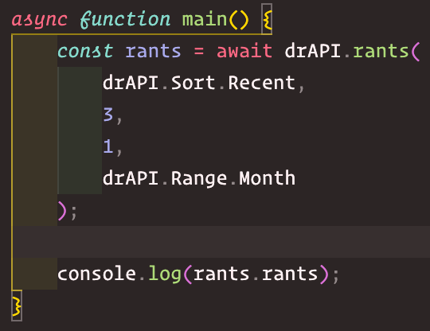

# The great Rantscript done better in TypeScript

> Know what to provide!
> 

> Know what you get!
> 

# Custom requests

Endpoint not available, or not documented? Make a custom request!

```typescript

import DevRantAPI from 'ts-devrant'

DevRantAPI.request(
    'secret-endpoint',
    {
        myBody: true
    },
    {
        header: {
            x-new-header: "secret"
        }
    }
)

```
